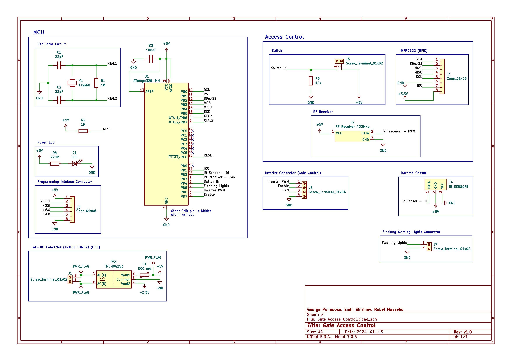

# Gate Access Control - PCB Design

A custom-designed PCB for a smart gate access control system, created using KiCad. It features both programming and power management components intended as part of a smart automation system for gates. This project was done as part of a university group assignment.

The system allows access via RF remote, switch or RFID tag and includes safety mechanisms like human detection inputs (photo sensors) that prevent gate operation. The board is designed to be AC-powered, with an onboard AC-DC converter and expansion-ready via various screw terminals and headers.

---

## Project Overview

This project involved designing a custom PCB using **KiCad 7**, building the schematic and layout, selecting components and producing a bill of materials. 

## Project Concept

> “Make a device that authenticates the opening of a gate using a remote, switch or RFID tag and opens the gate using a motor drive - unless two photo sensors detect a person near the gate.”

**System Requirements:**
- Input options: RF remote, switch, RFID
- Output: Control signals to motor/inverter (speed + direction)
- Safety: If two photo sensor inputs detect a person, do not open gate; flash warning lights instead
- Power: Must be powered by **AC mains** using an onboard **AC-DC converter**
- Controller: Custom implementation using **ATmega328 (from Arduino Uno R3)**

**Safety Considerations:**

- **AC spacing**: >6.35mm between live and neutral traces to prevent arcing
- **Creepage distance** maintained around J1 (power input)
- **Fuse** to limit overcurrent from AC-DC converter
- **Trace width** increased for AC paths

---

## PCB and Schematic Preview

### Schematic

See pdf [here](./docs/Printable%20Schematic%20-%20Gate%20Access%20Control.pdf) for a detailed view.

### PCB Layout
 

### 3D View

---

## 🧾 Bill of Materials (BOM)

> For detailed pricing and sourcing: [See BOM PDF](<./docs/BOM (Gate Access Control).pdf>)

[Download CAM Files (Gerbers + Drill Maps)](<./docs/CAM Files - Gerber and Drill Maps.zip>)  
These were used to estimate PCB production cost and can be uploaded to fabrication services (such as PCBway).

## Tools Used

- **KiCad 7** – Schematic and PCB design
- **Mouser** – Component sourcing
- **GitHub** – Project version control and documentation

## Team

- [George Punnoose](https://www.github.com/George-P-1) (Lead)
- [Emin Shirinov](https://github.com/Codeexia0)
- [Robel Massebo](https://www.github.com/RobelKa)

This project was developed for academic purposes and may require adaptation for industrial or commercial deployment.